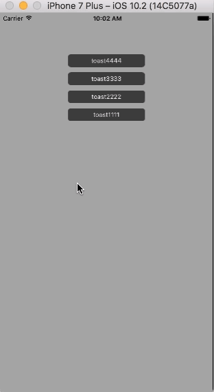

# ZXAnimatedMultiToast

多消息Toast提示。效果图如下。

 

如果想要自己修改：

1） 自己修改frame的话，可以使用 `Masonry`,或者自己手动定义 frame

2） 时间参数修改定时器的时间。
 
3） 如果要区分消息的话，可以对 `ZXAnimatedToastMessage` 添加属性，例如一个 `uuid` 作为标志符。

4） 如果想要修改显示动画的话，修改


 ```obj
 - (void)tableView:(UITableView *)tableView
 forRowAtIndexPath:(NSIndexPath *)indexPath
   animationStyle:(UITableViewCellDisplayAnimationStyle)animationStyle
 ```

 方法中的动画。


## 主要思想

1） `willDisplayCell`  中做动画。

2） 定时器来处理消失

3） `tableView` 的 update 完成 reaload

----


其他的实现可以参考：


##  CardTilt

[https://github.com/neworiginou/CardTilt](https://github.com/neworiginou/CardTilt)

关键代码:

在展示cell之前，创建一个初始的Transform，在将要展示cell的时候，给cell的layer一个动画。

```objc
    CGFloat rotationAngleDegrees = -15;
    CGFloat rotationAngleRadians = rotationAngleDegrees * (M_PI/180);
    CGPoint offsetPositioning = CGPointMake(-20, -20);
    
    CATransform3D transform = CATransform3DIdentity;
    transform = CATransform3DRotate(transform, rotationAngleRadians, 0.0, 0.0, 1.0);
    transform = CATransform3DTranslate(transform, offsetPositioning.x, offsetPositioning.y, 0.0);
    self.initialTransformation = transform;
    
    self.shownIndexes = [NSMutableSet set];
}

#pragma mark - UITableViewDelegate

- (void)tableView:(UITableView *)tableView willDisplayCell:(UITableViewCell *)cell 
		forRowAtIndexPath:(NSIndexPath *)indexPath {
    if (![self.shownIndexes containsObject:indexPath]) {        
        UIView *card = [(CTCardCell* )cell mainView];
        
        card.layer.transform = self.initialTransformation;
        card.layer.opacity = 0.8;
        
        [UIView animateWithDuration:0.4 animations:^{
            card.layer.transform = CATransform3DIdentity;
            card.layer.opacity = 1;
        }];
    }
}
```

## tableView_display_animation

[https://github.com/slipawayleaon/tableView_display_animation](https://github.com/slipawayleaon/tableView_display_animation) 

关键点在于`willDisplayCell`的时候，对cell的frame做了改变，然后做了一个动画。


```objc
- (void)tableView:(UITableView *)tableView willDisplayCell:(UITableViewCell *)cell
	 forRowAtIndexPath:(NSIndexPath *)indexPath {
    /// 获取cell显示动画类型
    UITableViewCellDisplayAnimationStyle animationStyle =
     (UITableViewCellDisplayAnimationStyle)(self.index);
    /// 在这里调用cell显示动画方法
    [cell tableView:tableView forRowAtIndexPath:indexPath animationStyle:animationStyle];
}

```


```objc
 case UITableViewCellDisplayAnimationRight: {
        CGRect originFrame = self.frame;
        CGRect frame = self.frame;
        frame.origin.x = tableView.frame.size.width;
        self.frame = frame;
        
        NSTimeInterval duration = 0.5 + (NSTimeInterval)(indexPath.row) / 10.0;
        [UIView animateWithDuration:duration animations:^{
            self.frame = originFrame;
        } completion:nil];
        break;
    }
    case UITableViewCellDisplayAnimationTopTogether: {
        CGRect originFrame = self.frame;
        CGRect frame = self.frame;
        frame.origin.y = -frame.size.height;
        self.frame = frame;
        
        NSTimeInterval duration = 0.5f;
        [UIView animateWithDuration:duration animations:^{
            self.frame = originFrame;
        } completion:nil];
        break;
    }
```

## tableview-animation

[https://github.com/crossPQW/tableview-animation](https://github.com/crossPQW/tableview-animation)

关键点：

根据scollview的contentOffset与当前cell的位置，对cell的scale进行调整。


```objc
 - (void)scrollViewDidScroll:(UIScrollView *)scrollView
{
    CGFloat viewHeight = scrollView.bounds.size.height + scrollView.contentInset.top;
    for (TableViewCell *cell in [self.tableview visibleCells]) {
        CGFloat y = cell.centerY - scrollView.contentOffset.y;
        CGFloat p = y - viewHeight / 2;
        CGFloat scale = cos(p / viewHeight * 0.9) * 0.95;
        [UIView animateWithDuration:0.15 delay:0 options:UIViewAnimationOptionCurveEaseInOut | UIViewAnimationOptionAllowUserInteraction | UIViewAnimationOptionBeginFromCurrentState animations:^{
            cell.image.transform = CGAffineTransformMakeScale(scale, scale);
        } completion:NULL];
    }
}
``` 


## YUScrollingAnimation

[https://github.com/c6357/YUScrollingAnimation.git](https://github.com/c6357/YUScrollingAnimation.git)

这个人厉害啊，写了这么多的扩展。

关键点：在yuScrollViewDidScroll的时候，对cell的frame坐动画。

```objc
-(void)yuScrollViewDidScroll:(UIScrollView *)scrollView Animation:(BOOL)animation{
    
    NSArray *cellArry = [self visibleCells];
    UITableViewCell *cellFirst = [cellArry firstObject];
    UITableViewCell *cellLast  = [cellArry lastObject];
    
    for (UITableViewCell *cell in cellArry) {
        
        {
            CGRect frame = cell.contentView.frame;
            frame.origin.y = 0;
            cell.contentView.frame = frame;
            cell.layer.zPosition = 0;
            cell.alpha = 1;
        };
        
        {
            CGRect frame = cell.frame;
            frame.origin.x = 0;
            frame.size.width = APP_WIDTH();
            cell.frame = frame;
        };
    }
    
    
    cellFirst.layer.zPosition = -1;
    cellLast.layer.zPosition = -1;
    
    
    if(!(scrollView.contentOffset.y <= 0 || scrollView.contentOffset.y >=
        (scrollView.contentSize.height-scrollView.frame.size.height)))
    {
        CGPoint point = [self convertPoint:[self rectForRowAtIndexPath:
        [self indexPathForCell:cellFirst]].origin toView:[self superview]];
        if(animation)
        {
            double py =  fabs(point.y);
            float scale;
            
            //if (scrollView.contentOffset.y > oldOffset)
            {
                scale = (py/cellFirst.H);
                cellFirst.alpha = 1-scale;
                
                CGRect frame = cellFirst.frame;
                frame.origin.x = offsetX*scale;
                frame.size.width = APP_WIDTH()-2*(offsetX*scale);
                cellFirst.frame = frame;
            }
            
            {
                scale = ((cellFirst.H-py)/cellFirst.H);
                cellLast.alpha = 1-scale;
                
                CGRect frame = cellLast.frame;
                frame.origin.x = offsetX*scale;
                frame.size.width = APP_WIDTH()-2*(offsetX*scale);
                cellLast.frame = frame;
            }
        }
        
        if(0 != point.y)
        {
            CGRect frame = cellFirst.contentView.frame;
            frame.origin.y = -point.y;
            cellFirst.contentView.frame = frame;
            
            frame = cellLast.contentView.frame;
            frame.origin.y = - frame.size.height - point.y;
            cellLast.contentView.frame = frame;
        }
    }
    
    oldOffset = scrollView.contentOffset.y;
}
``` 
